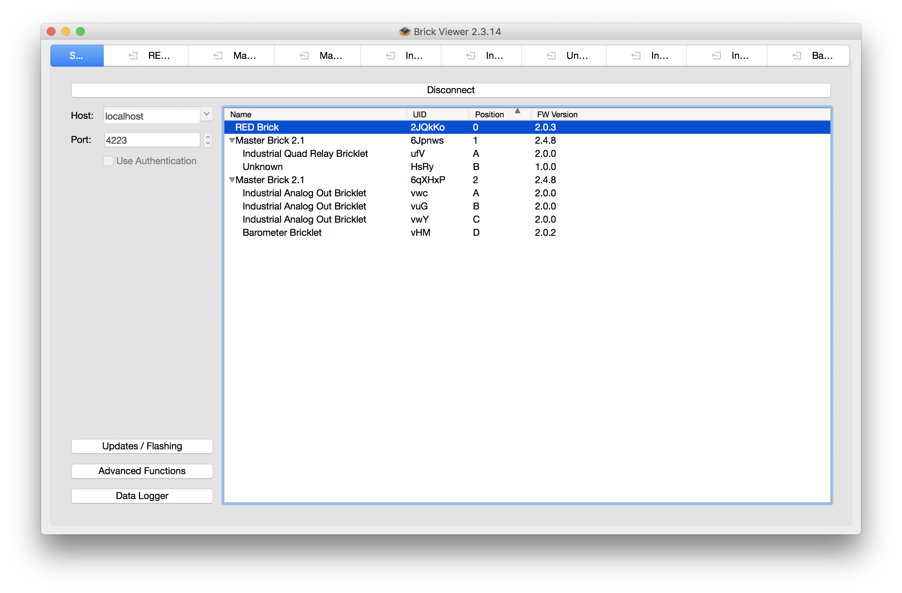

# Fimware Installation

The BunkerBox industrial controller utilizes the RED Brick microcontroller from TinkerForge. More information on the RED Brick can be found at https://www.tinkerforge.com/en/doc/Hardware/Bricks/RED_Brick.html#red-brick.

The RED Brick utilizes an RTOS running Debian Linux, and full instructions for installing the OS can be found at https://www.tinkerforge.com/en/doc/Hardware/Bricks/RED_Brick.html#red-brick-images.

To install the firmware, you will need the following items:

- A Micro-SD card with at least 8GB of space.
- A USB 2.0 Mini-B cable.

#### To install the Linux operating system for the RED Brick:

1. Download the Etcher SD card flashing software from https://etcher.io/.
1. Download the latest RED Brick Image from https://www.tinkerforge.com/en/doc/Downloads.html#downloads-red-images.
1. Unzip the Red Brick Image. This should result in a file that looks something like `red_image_1_11_full.img`. You may need to install a separate program that extracts 7z files.
1. Insert a blank Micro-SD card into your computer.
1. Open the Etcher application.
1. Click the `Select image` button in Etcher and choose the .img file you extracted earlier.
1. Make sure the center of the Etcher screen shows your Micro-SD card— if it doesn't click the `Change` button to select it.
1. Click the `Flash!` button.
1. The flashing process may take 10-15 minutes depending on the speed of your computer and Micro-SD card.
1. Once the flashing process is done, eject the Micro-SD card from your computer, make sure the RED Brick is turned off, and insert the Micro-SD card into the RED Brick.

#### Preparing the RED Brick for the control system:

1. Download and install the `Brick Daemon` and `Brick Viewer` software for your operating system from https://www.tinkerforge.com/en/doc/Downloads.html#tools.
1. With the Micro-SD card inserted into the RED Brick, plug a USB cable from your computer to the RED Brick. The RED Brick should being to power on and boot up.
1. Open the `Brickv` (Brick Viewer) application you downloaded earlier and click the `Connect` button.
1. It may take 2-3 minutes for the RED Brick to boot up. Once it is fully booted you should see a screen that looks similar to the following:

1. Double-click on the `RED Brick` item in the menu (or click on the tab up top). Note— it may take a few minutes for the RED Brick to be responsive after an initial bootup.
1. Click on the tab named `Settings` on the left side of the screen, followed by the tab named `Services` on the top of the screen.
1. Uncheck **all** of the services— you won't need any of these for the BunkerBox control system. Click the `Save and Reboot` button.
1. Wait a few minutes for the RED Brick to restart. You'll know the system has restarted when the RED Brick displays in the list of devices again. Once this is done, navigate back to the RED Brick tab.
1. Click back to the `Settings` tab, then click on the `File System` tab up top. If the used capacity shows less than 100% you can expand the space on your SD card— it's usually a good idea to do this. Press the `Reboot and Expand` and wait up to 15 minutes for it to reboot.

#### Setting up networking:

1. Click back to the `Settings` tab, then click on the `Network` tab up top. You can always modify these later using the same steps.

##### If connecting to wired ethernet:

1. Plug an ethernet cable into the Ethernet Brick connected to the RED Brick.
1. Under the `Interfaces` dropdown, select `tf0 : Wired`.
1. Press the `Connect` button.
1. The status should changed to Connected and you should see an IP address assigned to the device.

##### If connecting to Wifi:

1. Make sure a compatible USB Wifi adapter (like https://www.tinkerforge.com/en/shop/wifi-usb-adapter.html) is connected to the USB port of the RED Brick.
1. Under the `Interfaces` dropdown, select `xxxxxx : Wireless` (the xxxxx part will vary from system to system).
1. Select your wireless network name under `Access Points`.
1. Enter the password for your wireless network in the input box next to `WPA Key:`.
1. Press the `Connect` button.
1. The status should changed to Connected and you should see an IP address assigned to the device.

**Note: you must have a valid network connection before you can move on to the next part**

#### Installing the BunkerBox control system:

1. Download the script at https://raw.githubusercontent.com/bunker-stills/bunkerbox/master/tf-redbrick-run.js and save it to your computer hard drive.
1. Click on the `Program` tab on the left
1. Click on the `New` button near the bottom
1. Use the following settings:
1. Name: `BunkerBox`
1. Language: `JavaScript (Browser/Node.js)`
1. Click `Continue`
1. Click `Add Files`
1. Find the `tf-redbrick-run.js` file you just downloaded and choose it
1. Click `Continue`
1. JavaScript Flavor: `Server-Side (Node.js 8.10.0)`
1. Script File: `tf-redbrick-run.js`
1. Click `Continue`
1. Click `Continue`
1. Source: `/dev/null`
1. Both Targets: `Individual Log Files`
1. Click `Continue`
1. Mode: `Always`
1. Check `Continue After Error`
1. Click `Continue`
1. Click `Continue`
1. Click `Start Upload`
1. Click `Done`

The BunkerBox control system will now start to install itself and boot up. Note it may take up to 30 minutes or more for this to happen the first time.